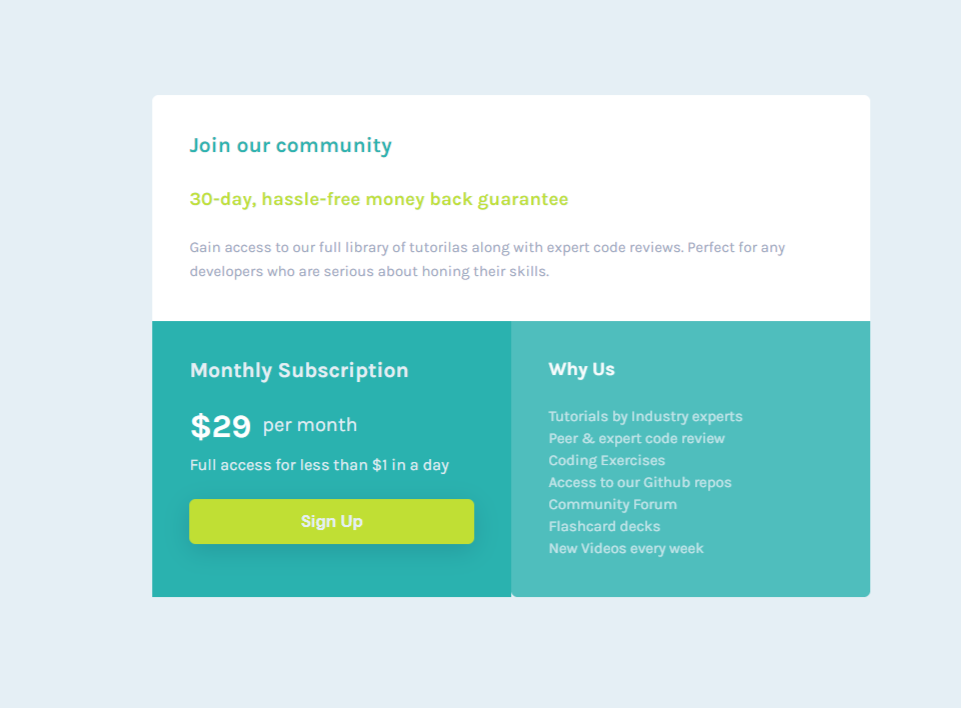

# Frontend Mentor - Single price grid component solution

This is a solution to the [Single price grid component challenge on Frontend Mentor](https://www.frontendmentor.io/challenges/single-price-grid-component-5ce41129d0ff452fec5abbbc). Frontend Mentor challenges help you improve your coding skills by building realistic projects. 

## Table of contents

- [Frontend Mentor - Single price grid component solution](#frontend-mentor---single-price-grid-component-solution)
  - [Table of contents](#table-of-contents)
  - [Overview](#overview)
    - [The challenge](#the-challenge)
    - [Screenshot](#screenshot)
    - [Links](#links)
  - [My process](#my-process)
    - [Built with](#built-with)
    - [What I learned](#what-i-learned)
    - [Useful resources](#useful-resources)
  - [Author](#author)
  - [Acknowledgments](#acknowledgments)
  
  - [Useful resources](#useful-resources)
- [Author](#author)
- [Acknowledgments](#acknowledgments)

**Note: Delete this note and update the table of contents based on what sections you keep.**

## Overview

### The challenge

Users should be able to:

- View the optimal layout for the component depending on their device's screen size
- See a hover state on desktop for the Sign Up call-to-action

### Screenshot

### Links

- Solution URL: [Add solution URL here](https://your-solution-url.com)
- Live Site URL: [Add live site URL here](https://your-live-site-url.com)

## My process

### Built with

- Semantic HTML5 markup
- CSS custom properties
- Flexbox
  

### What I learned

With making this project, I learnt to make layout of web pages using CSS Flexbox. Also learnt how to make same page for mobile view.

### Useful resources

- [CSS Flexbox](https://css-tricks.com/snippets/css/a-guide-to-flexbox/) - This helped me for learning CSS Flexbox. I really liked this article. and will recoomend everyone who wants to learn CSS Flexbox.
- [FreeCodecamp](https://www.freecodecamp.org/learn/responsive-web-design/) - This is an amazing website which helped me learning responsive web design. You may check it once.

## Author

- Linkedin - [Saurav Kumar Sonu](https://www.linkedin.com/in/sauravkumarsonu/)
- Frontend Mentor - [ItsmeSauravSonu](https://www.frontendmentor.io/profile/ItsmeSauravSonu)
- Twitter - [@saurav_s07](https://www.twitter.com/saurav_s07)

## Acknowledgments

I would like to thank Front-End Mentor team for giving me this opportunity.

